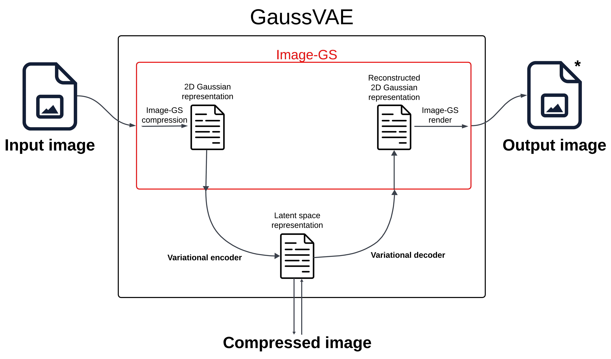

# GaussVAE: Compression of 2D Gaussian Splatting via Variational Autoencoders

**Author:** Roko Čubrić  
**Institution:** Faculty of Electrical Engineering and Computing, University of Zagreb \
**Status:** Early-stage development, active experimentation


---

## Motivation

Inspired by recent advances in deep neural networks and variational autoencoders, and considering the increasing integration of AI systems in robotics, I pursued a novel approach to image compression. Modern autonomous systems require efficient visual memory management: robots operating in complex environments must store extensive visual information within limited onboard memory while maintaining sufficient fidelity for navigation and decision-making tasks. This constraint motivates the development of specialized compression techniques that balance memory efficiency with perceptual quality.

Traditional image compression via variational autoencoders typically operates directly on pixel representations. While effective, these methods often employ block-based encoding schemes that partition images into fixed-size regions, processing each independently. This approach can introduce blocking artifacts and fails to leverage global structural coherence within natural images.

In 2025, Intel Research introduced Image-GS, a technique that represents images as collections of 2D Gaussian splats that can be optimized to reconstruct images with high fidelity. Each Gaussian is parametrized by position, scale, rotation, and color, providing a continuous, object-centric representation rather than a pixel grid. This representation offers potential advantages for compression: Gaussians naturally encode smooth regions and gradients more efficiently than discrete pixels, and their parametric nature allows for variable-rate encoding where complex regions can be represented with more Gaussians while simple regions require fewer.

Building on this foundation, I hypothesized that variational autoencoders could exploit their pattern recognition and learned embedding capabilities to further compress these Gaussian representations. Rather than compressing pixels, this approach compresses the learned Gaussian parameters themselves, potentially achieving superior compression ratios while maintaining reconstruction quality. The inherent trade-off is the loss of exact pixel-level details, which is acceptable for many perception tasks where structural and semantic content preservation is prioritized over lossless reconstruction.

## Architecture



The system implements a two-stage compression pipeline:

1. **Image-GS Stage:** Images are encoded into 512 2D Gaussian splats, each parametrized by 8 values (position, scale, rotation, RGB features).
2. **VAE Stage:** The Gaussian parameters are compressed via a variational autoencoder from 4096 dimensions (512 × 8) to a 512-dimensional latent representation, achieving 8:1 compression.

### Preprocessing: Morton Space-Filling Curve


To preserve spatial locality when treating 2D Gaussian positions as a 1D sequence, I employ Morton ordering (Z-order curve). This space-filling curve interleaves the x and y coordinates of Gaussian centers, ensuring that spatially adjacent Gaussians remain close in the sequential representation. This preprocessing step is critical for 1D convolutional networks to learn meaningful spatial patterns.

### Network Architectures

Two architectures have been implemented and tested:

**1. Baseline Conv1D VAE (1.6M parameters):**
- Encoder: Three 1D convolutional layers with progressive channel expansion (32 → 64 → 128 filters)
- Latent space: 256 or 512 dimensions
- Decoder: Three 1D convolutional layers with progressive channel reduction (64 → 32 → 16 filters)
- Activation: ReLU throughout
- Loss: MSE reconstruction + β-weighted KL divergence with linear annealing

**2. ResNet Conv1D VAE (~16M parameters):**
- Encoder: Five ResNet blocks with residual connections (32 → 256 filters)
- Latent space: 512 dimensions
- Decoder: Five ResNet blocks with residual connections (256 → 16 filters)
- Improved gradient flow via skip connections
- Same loss formulation as baseline

Both networks process the spatially-sorted Gaussian parameters using 1D convolutions, treating the sequence of 512 Gaussians as a temporal signal.

## Viewing Training Metrics

To visualize training curves in TensorBoard:

```bash
# Start the tensorboard container (make sure port 6006 is free)
docker-compose up tensorboard
```

Then open http://localhost:6006 in your browser.

## Monthly Reports

### October 2025: The Initial Concept & Data Sorting

The core idea was simple: apply Variational Autoencoders to compress Gaussian Splatting representations. Since Gaussian Splats are fundamentally sets of unordered primitives, applying standard convolutional architectures is non-trivial. My first step was to impose a spatial ordering on the Gaussians to make them amenable to 1D convolutions.

I implemented Morton Z-order sorting (Z-curve) to linearize the 2D spatial distribution of the Gaussians. This preprocessing step ensures that spatially proximal Gaussians are also close in the 1D sequence fed into the network. This was crucial for the Conv1D layers to learn meaningful local features.

*Relevant Notebook:* `notebooks/01_data_pipeline_test.ipynb`

### November 2025: First VAE Prototypes & KL Collapse

I began training the first VAE models (runs 002-006). The initial results showed a common failure mode in VAE training: posterior collapse. The KL divergence term would vanish, effectively turning the VAE into a standard autoencoder but with a useless latent space.

To isolate the reconstruction capability, I ran experiments where I effectively shut down the KL loss (setting $\beta=0$ or very low). This allowed me to verify if the architecture could compress and reconstruct the data at all. The results indicated a high bias in reconstruction, particularly affecting rotation and color feature parameters:

- Position (xy) parameters: Loss converges to ~0.1 (acceptable)
- Scale parameters: Loss converges to ~0.2 (acceptable)
- Rotation parameters: Loss plateaus at ~1.0-1.2 (poor)
- Color features: Loss plateaus at ~1.0 (poor)

These results suggested that the capacity of the initial models (256D/512D latent) might be insufficient for the complexity of the signal.

*Relevant Notebook:* `notebooks/08_vae_multi_image_demo.ipynb`

### December 2025: Scaling Up & Weighted Losses

For this month, I significantly scaled up the architecture. I hypothesized that the previous models simply lacked the capacity to capture the high-frequency details of the Gaussian parameters. I expanded the latent dimension to 2048, aiming for a 2x compression ratio.

I implemented a much "chunkier" ResNet-based architecture:

**Model Parameter Counts:**
```text
Total parameters: 54,207,063
Encoder parameters: 12,246,304 (22.6%)
Decoder parameters: 41,911,848 (77.3%)
```

I also experimented with weighted losses, specifically trying to balance the reconstruction terms for position (xy), rotation, scale, and features (color). Despite training for over 500 epochs, the losses for rotation, scale, and features struggled to converge.

My current hypothesis is that the decoder is the bottleneck. It might not be "strong" enough, or perhaps the Conv1D ResNet architecture is ill-suited for decoding this specific type of set data, even with Morton sorting. Apart from the obvious flaw of trying to use an autoencoder on an input that is fundamentally a set, the mapping from a latent vector back to a set of parameters with complex interdependencies remains a significant hurdle.

*Relevant Notebook:* `notebooks/10_vae_minimal_demo_run012.ipynb`

## Experimental Setup

**Hardware:** Google Cloud Compute Engine VM with NVIDIA Tesla T4 GPU (16GB VRAM)  
**Framework:** TensorFlow 2.12, CUDA 11.8  
**Dataset:** The Delaunay dataset (11,501 abstract art images generated via Delaunay triangulation), split 10,502 train / 500 validation / 499 test. This dataset was chosen for its abstract and general nature, providing diverse geometric patterns for initial experimentation. Future work will explore domain-specific datasets (e.g., faces, eyes) where the VAE could potentially learn more specialized structural patterns.  
**Reproducibility:** All experiments conducted in Docker containers with fixed random seeds

## Acknowledgments

This project builds upon the Image-GS technique developed by Intel Research and New York University's Immersive Computing Lab. The implementation is original work, but the Gaussian splatting foundation is provided by their open-source release.

**Image-GS Resources:**
- Repository: https://github.com/NYU-ICL/image-gs
- Project Page: https://www.immersivecomputinglab.org/publication/image-gs-content-adaptive-image-representation-via-2d-gaussians/

I would like to thank Dr. Yunxiang Zhang for his encouragement and valuable feedback during the early stages of this project.

**Dataset:**
This project uses the Delaunay dataset by Camille Gontier, released under the MIT License.

## License

MIT License. See `LICENSE` for details.

Third-party licenses (Image-GS, Delaunay dataset): See `THIRD_PARTY_LICENSES.md`

---

**Repository:** https://github.com/rokocuba/GaussVae-showcase  
**Contact:** For questions regarding this research, please open an issue on GitHub.
